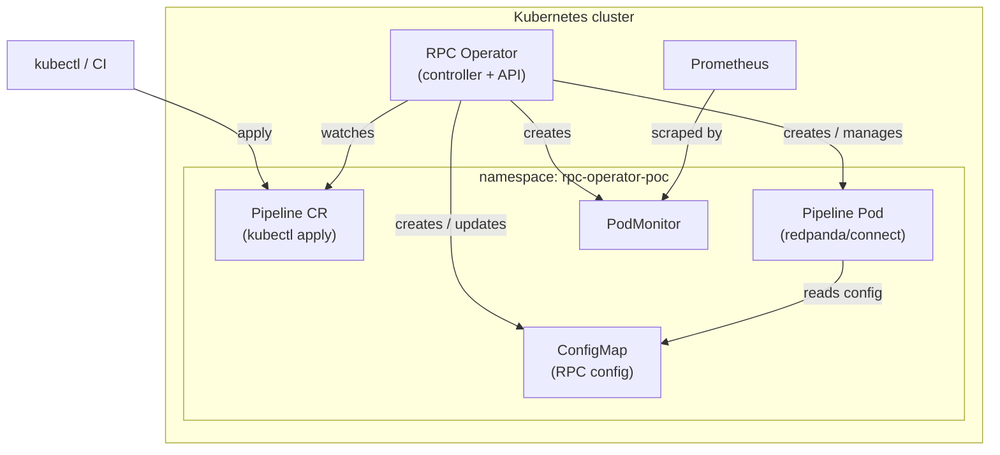
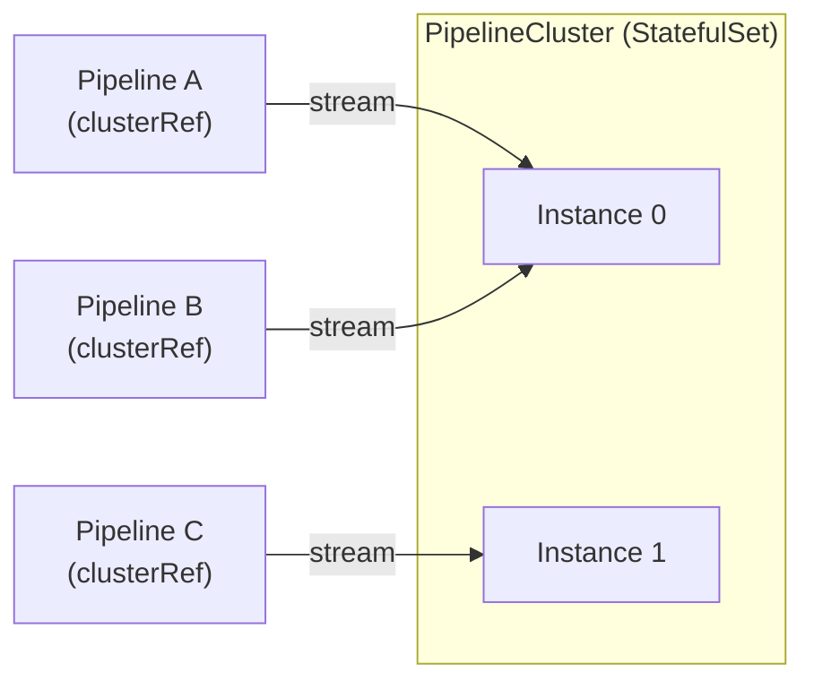

# Architecture at a glance

> **Audience:** Both
> **Prerequisites:** [Who should read what?](audience.md)

This page shows how the RPC Operator fits into a Kubernetes cluster and how data flows through a pipeline.

## Component overview

## Pod mode (default)

Each `Pipeline` CR results in one dedicated pod that runs a Redpanda Connect process. The operator:

1. Watches all `Pipeline` CRs across allowed namespaces
2. Renders the `spec.rawYAML` value into a ConfigMap (injecting the HTTP server block if absent)
3. Creates a Pod that mounts the ConfigMap as a config file and runs `redpanda-connect run`
4. Creates a `PodMonitor` so Prometheus scrapes throughput metrics from the pod's HTTP metrics endpoint
5. Reflects pod phase (`Pending` / `Running` / `Failed` / `Stopped`) into `status.phase`

## Stream mode (PipelineCluster)

When a `Pipeline` has `spec.clusterRef` set, it runs as a lightweight *stream* inside a shared `PipelineCluster` instead of getting its own pod. The cluster is a StatefulSet of Redpanda Connect instances running in [streams mode](https://docs.redpanda.com/redpanda-connect/configuration/streams_mode/about/). The operator uses the Redpanda Connect streams HTTP API to deploy and manage individual streams.

Use stream mode when you have many short-lived or low-throughput pipelines and want to avoid per-pipeline pod overhead.

## Authentication model

The operator exposes a REST API (default `:8082`) that serves both the pipeline management endpoints and the embedded web UI. Access is controlled by one of three modes:

| Mode | Description |
|---|---|
| **A — Auth off** | No login required (dev/demo only) |
| **B — Bearer token** | Login with a Kubernetes service account token; the operator forwards it to the apiserver on each request |
| **C — Anonymous reads** | Like B, but unauthenticated GETs are allowed (status-board use case) |

OIDC (F20b) is additive on Mode B: it adds an SSO login button without removing the Bearer-token path.
